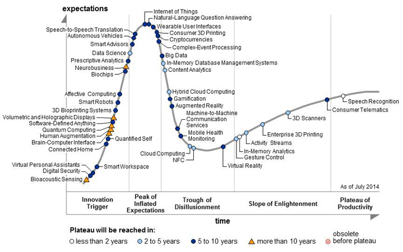

## Today's talk

* Why might you care
* What is big data doing anyway?
* Thoughts from Chicago
* Implications for evaluation work
* Implications for evaluator skills

## Why might you care

* A new type of evaluand
* New insight as background knowledge
* New data for old evaluands
* A whole new skillset

# What is big data 

## Some unsatisfactory definitions

> - "Data sets that are so large or complex that traditional data processing applications are inadequate."
> - "Velocity, volume, variety"
> - "The convergence of enterprise and consumer IT"
> - "The new tools helping us find relevant data and analyze its implications."
> - "A new attitude ... that combining data from multiple sources could lead to better decisions."

## My definition (today)

*Digital traces of everyday activity, collected and stored at much finer resolution and higher frequency than pre 2000*

> - wearable devices like fitbits
> - individual financial transactions
> - mouse events
> - motion sensors
> - CCTV
> - GPS tracking in phones and cars
> - smart electricity meters

## Different types


# Some examples

## 


## Capacity planning


## 


##


##


## 


# No longer "hype"?

## Gartner hype cycle 2014



## Gartner hype cycle 2014


## Official statistics


## {data-background-video="rotating2.mp4"}

# Thoughts from a Chicago roundtable

## Opportunities

> - Build counterfactuals when not previously possible?
> - Whole new sources of data?
> - Use predictive capabilities to plan quasi-experiments
> - Provide clues to what needs further examination by other methods

## Reservations expressed

> - Populations we work with often don't leave a digital trail
> - Satellite imagery good for environmental work, but what is the social equivalent?
> - Do evaluators have the skills?
> - New analytical methods better at prediction than explaining causality...

## Michael Bamberger's 'high applicability' set (1) {data-transition="fade-out"}

> - Large, complex interventions
> - Conventional evaluation designs methodologically weak
> - Easy, physical measurement
> - Indicators have construct validity

## Michael Bamberger's 'high applicability' set (2) {data-transition="fade-in"}

> - Long duration
> - Continue to operate beyond proof of concept so can test against prediction
> - Large number of potential variables and no clear theoretical way through
> - No political concerns about data ownership, privacy etc


# So what might it mean in New Zealand...

## New evaluands

* Government and even NGO programs will increasingly be based on data-intensive analytics (eg social investment approach)
* Private sector is embracing this area fast, although New Zealand has a way to go
* When the evaluand is a big-data intervention, you'll need to construct a big data quasi experiment to be credible

## New sources of insight outside the evaluand

* Official statistics will increasingly be based on admin data including big data
* Big data will change the background level of knowledge in many areas of social science
* Other countries' social and economic sectors will build much more profound understanding of what works

## New methods

* Interventions that don't think of themselves as "big data" will increasingly generate it as a side product
* We won't have the luxury of insisting on exactly the right indicator, but will have to get (very) good at separating the signal from the noise with proxies
* We have to get on top of the accidental opportunities arising from the routine storage of sensor, administrative, and other information


## A whole new skillset

```{r, cache = TRUE, echo = FALSE, fig.height = 6, fig.width = 6}
library(gridExtra)
library(grid)
library(RColorBrewer)

palette <- brewer.pal(3, "Set1")


radius <- 0.3
strokecol <- "grey50"
linewidth <- 4
fs <- 11

draw_diagram <- function(){
grid.newpage()
grid.circle(0.33, 0.67, radius, gp = 
               gpar(col = strokecol,
                    fill = palette[1],
                    alpha = 0.2,
                    lwd = linewidth))

grid.circle(0.67, 0.67, radius, gp =
            gpar(col = strokecol,
                 fill = palette[2],
                 alpha = 0.2,
                 lwd = linewidth))

grid.circle(0.5, 0.33, radius, gp =
               gpar(col = strokecol,
                    fill = palette[3],
                    alpha = 0.2,
                    lwd = linewidth))

grid.text("Hacking", 0.25, 0.75, rot = 45, gp =
             gpar(fontsize = fs * 2.3,
                  col = palette[1],
                  fontface = "bold"))

grid.text("Statistics", 0.75, 0.75, rot = -45, gp =
             gpar(fontsize = fs * 2.3,
                  col = palette[2],
                  fontface = "bold"))

grid.text("Content\nknowledge", 0.5, 0.25, rot = 0, gp =
             gpar(fontsize = fs * 2.3,
                  col = palette[3],
                  fontface = "bold"))

grid.text("Danger:\nno context", 0.5, 0.75,
          gp = gpar(fontsize = fs))

grid.text("Danger: no\nunderstanding\nof probability", 0.32, 0.48, rot = 45,
          gp = gpar(fontsize = fs))

grid.text("Traditional\nresearch", 0.66, 0.46, rot = -45,
          gp = gpar(fontsize = fs))


grid.text("Data science /\napplied\nstatistics", 0.5, 0.55, 
          gp = gpar(fontsize = fs * 1.2,
                    fontface = "bold"))
}
draw_diagram()

```

## References

* http://www.datameer.com/wp-content/uploads/2015/11/Telco-Network-Capacity-Planning.pdf
* http://www-01.ibm.com/software/data/bigdata/use-cases/enhanced360.html
* https://lindaraftree.com/2015/11/23/big-data-in-development-evaluation/
* http://drewconway.com/zia/2013/3/26/the-data-science-venn-diagram
* http://www.kdnuggets.com/2015/08/gartner-2015-hype-cycle-big-data-is-out-machine-learning-is-in.html
* http://www.owen.org/blog/116